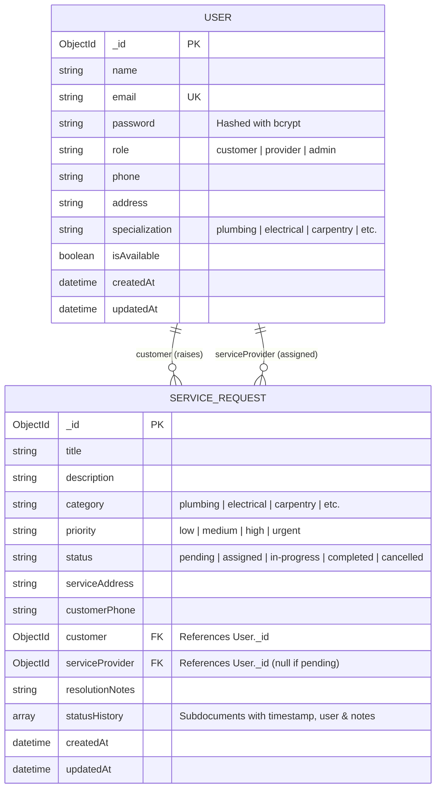
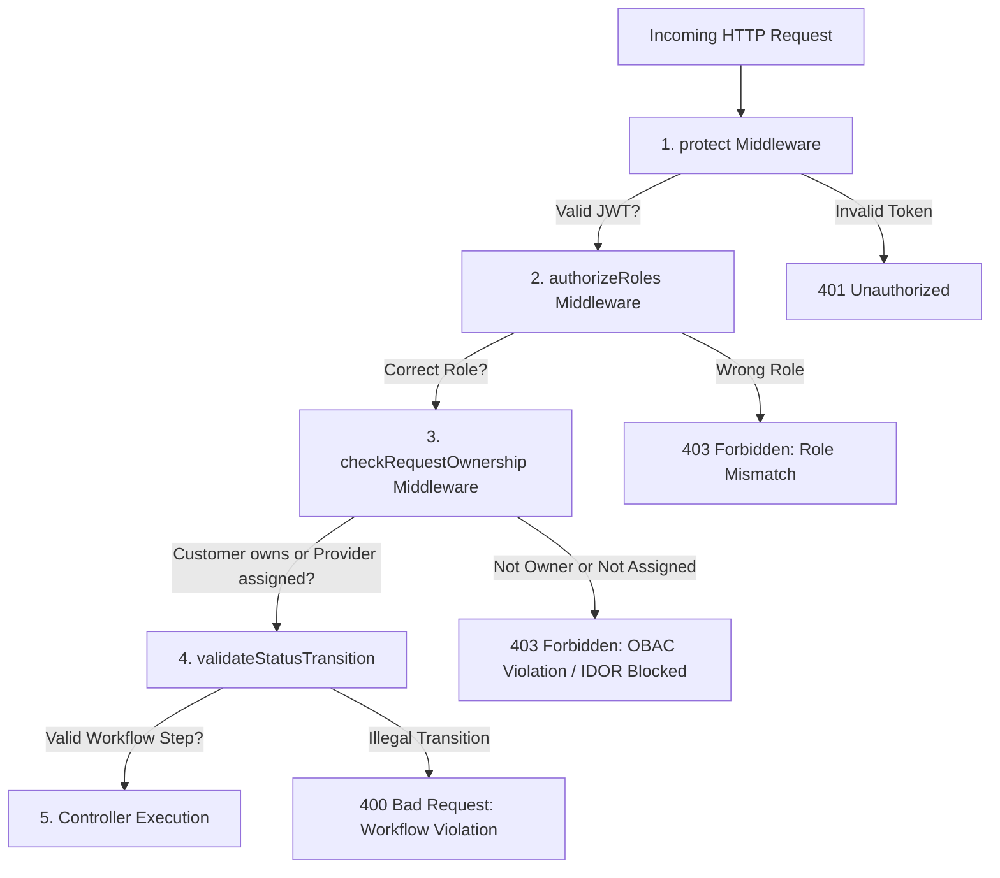
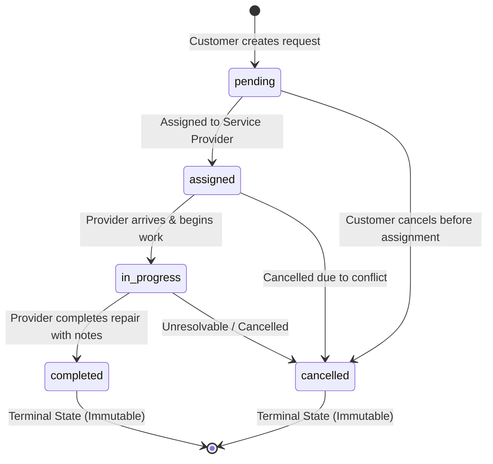

# 🛠️ Service Request Management System (Project #127)

> **B.Tech Computer Science Engineering — Backend Development (Node.js, Express.js & MongoDB)**  
> **Course:** ITM Skills University | School of FutureTech  
> **Author / Student:** Kushal Nakrani  
> **Stack:** Node.js • Express.js • MongoDB / Mongoose • JWT • React 19 • Vite  

---

## 📑 Table of Contents
1. [Project Overview & Problem Statement](#-project-overview--problem-statement)
2. [Key Objectives & Expected Outcomes](#-key-objectives--expected-outcomes)
3. [System Architecture & Design Decisions](#-system-architecture--design-decisions)
4. [Database Design & Entity Relationship (ER)](#-database-design--entity-relationship-er)
5. [Security & Authorization Model (RBAC vs OBAC)](#-security--authorization-model-rbac-vs-obac)
6. [Finite State Machine (FSM) Status Workflow](#-finite-state-machine-fsm-status-workflow)
7. [REST API Specification](#-rest-api-specification)
8. [Step-by-Step Setup & Execution Guide](#-step-by-step-setup--execution-guide)
9. [Pre-Seeded Demo Credentials for Evaluation](#-pre-seeded-demo-credentials-for-evaluation)
10. [Automated Verification Tests](#-automated-verification-tests)
11. [Postman & Thunder Client Testing](#-postman--thunder-client-testing)
12. [Professor Viva & Evaluation Q&A Cheat Sheet](#-professor-viva--evaluation-qa-cheat-sheet)

---

## 🎯 Project Overview & Problem Statement

A modern home-services company (similar to Urban Company or Housejoy) requires an automated, role-segregated platform where:
- **Customers** can raise home-service requests (e.g., plumbing, electrical, carpentry, AC repair) and track their status in real time.
- **Service Providers** (technicians/contractors) should view and update **only** the status of requests assigned directly to them.
- **Privacy & Isolation:** Customers must **never** be able to see requests created by other customers.
- **Integrity & Workflow:** Service providers must **never** tamper with or update requests belonging to other providers, and status transitions must strictly adhere to the business workflow (`pending` ➔ `assigned` ➔ `in-progress` ➔ `completed`).

---

## 🎯 Key Objectives & Expected Outcomes

| Requirement | Implementation Detail | Location |
| :--- | :--- | :--- |
| **Referenced Schemas** | Mongoose schemas with `ObjectId` document references between `Customer`, `ServiceProvider`, and `ServiceRequest`. | `backend/models/` |
| **Role-Based Authorization (RBAC)** | Restricts actions based on user type (`customer` vs `provider` vs `admin`). | `backend/middleware/roleMiddleware.js` |
| **Ownership-Based Authorization (OBAC)** | Validates that a user can only access/modify documents they own or are assigned to, preventing **IDOR** vulnerabilities. | `backend/middleware/ownershipMiddleware.js` |
| **Workflow State Machine** | Enforces valid status transitions (`assigned` ➔ `in-progress` ➔ `completed`). Rejects illegal jumps. | `backend/middleware/validationMiddleware.js` |
| **Data Validation** | Validates required fields, email regex, phone formatting, and string lengths before database writes. | `backend/middleware/validationMiddleware.js` |
| **React Frontend** | Decoupled client communicating via REST APIs; all business rules and authorizations live in Express/MongoDB. | `frontend/` |

---

## 🏗️ System Architecture & Design Decisions

The application follows the classic **MVC (Model-View-Controller)** pattern with a **Decoupled Client-Server REST Architecture**:

```
┌────────────────────────────────────────────────────────┐
│            React 19 + Vite Frontend (Port 3000)        │
│  - Dynamic Role Dashboard  - Workflow Progress Bar     │
│  - Service Request Form    - 1-Click Persona Switcher  │
└───────────────────────────┬────────────────────────────┘
                            │ HTTP JSON / Bearer JWT
                            ▼
┌────────────────────────────────────────────────────────┐
│             Express.js REST API (Port 5001)            │
│  ┌──────────────────────────────────────────────────┐  │
│  │ Middleware Pipeline:                             │  │
│  │ 1. CORS & JSON Body Parser                       │  │
│  │ 2. JWT Verification (authMiddleware.js)          │  │
│  │ 3. Role-Based Check (roleMiddleware.js)          │  │
│  │ 4. Ownership Check (ownershipMiddleware.js)      │  │
│  │ 5. FSM Workflow Validator (validationMiddleware) │  │
│  └──────────────────────────┬───────────────────────┘  │
│                             │                          │
│  ┌──────────────────────────▼───────────────────────┐  │
│  │ Controllers: authController.js, requestController│  │
│  └──────────────────────────┬───────────────────────┘  │
└─────────────────────────────┼──────────────────────────┘
                              │ Mongoose ODM
                              ▼
┌────────────────────────────────────────────────────────┐
│              MongoDB Database (Port 27017)             │
│  - users collection (Customers & Service Providers)    │
│  - servicerequests collection (Referenced ObjectIds)   │
└────────────────────────────────────────────────────────┘
```

### Why This Design Was Chosen:
1. **Separation of Concerns:** The frontend contains **zero** business logic or database access. If the React frontend were replaced by a mobile iOS/Android app tomorrow, the Express API would function without a single line changed.
2. **Stateless Scalability:** JWT authentication allows the server to remain stateless. Any server instance can authenticate requests using the shared `JWT_SECRET`.
3. **Database Normalization (Referenced Collections):** Instead of duplicating customer profile data inside every service request document, we store `customer: ObjectId` and `serviceProvider: ObjectId` and hydrate them using Mongoose `.populate()`.

---

## 🗄️ Database Design & Entity Relationship (ER)

The database schema utilizes **document referencing** to link requests with customers and service providers:



### Data Dictionary

#### 1. `User` Collection (`backend/models/User.js`)
- `name` (String, Required, Trimmed)
- `email` (String, Required, Unique, Lowercase, Regex validated)
- `password` (String, Required, Min 6 chars, `select: false`, hashed with bcrypt salt)
- `role` (String, Enum: `['customer', 'provider', 'admin']`, Default: `'customer'`)
- `phone` (String, Required)
- `address` (String, Default: `''`)
- `specialization` (String, Enum: `['plumbing', 'electrical', 'carpentry', 'ac-repair', 'appliance', 'painting', 'cleaning', 'general']`, Required if `role === 'provider'`)
- `isAvailable` (Boolean, Default: `true`)

#### 2. `ServiceRequest` Collection (`backend/models/ServiceRequest.js`)
- `title` (String, Required, Max 100 chars)
- `description` (String, Required, Max 1000 chars)
- `category` (String, Required, Enum)
- `priority` (String, Enum: `['low', 'medium', 'high', 'urgent']`, Default: `'medium'`)
- `status` (String, Enum: `['pending', 'assigned', 'in-progress', 'completed', 'cancelled']`, Default: `'pending'`)
- `serviceAddress` (String, Required)
- `customerPhone` (String, Required)
- `customer` (`ObjectId`, Required, Ref: `'User'`)
- `serviceProvider` (`ObjectId`, Default: `null`, Ref: `'User'`)
- `resolutionNotes` (String, Default: `''`)
- `statusHistory` (Array of objects: `{ status, updatedAt, updatedBy: Ref('User'), note }`)

---

## 🔐 Security & Authorization Model (RBAC vs OBAC)

A major requirement in software security is distinguishing between **Authentication**, **Role-Based Access Control**, and **Ownership-Based Access Control**:



### 1. Authentication (`backend/middleware/authMiddleware.js`)
- Client passes `Authorization: Bearer <token>` in the HTTP header.
- The middleware verifies the JWT against `JWT_SECRET`.
- Decodes the user ID and attaches the sanitized user document to `req.user`.

### 2. Role-Based Access Control — RBAC (`backend/middleware/roleMiddleware.js`)
- Validates *what type of user* is making the request.
- Example: Only users with `role: 'customer'` can execute `POST /api/requests`.
- Example: Only users with `role: 'provider'` can execute `PATCH /api/requests/:id/status`.

### 3. Ownership-Based Access Control — OBAC (`backend/middleware/ownershipMiddleware.js`)
- Prevents **Insecure Direct Object Reference (IDOR)** attacks.
- Even if User A is a valid `customer`, they cannot access `GET /api/requests/:id` if the request was raised by Customer B (`request.customer.toString() !== req.user._id.toString()`).
- Even if User C is a valid `provider`, they cannot modify `PATCH /api/requests/:id/status` if the job is assigned to Provider D (`request.serviceProvider.toString() !== req.user._id.toString()`).

---

## 🔄 Finite State Machine (FSM) Status Workflow

The lifecycle of each service request is enforced as a strict Finite State Machine inside `backend/middleware/validationMiddleware.js`:



### Valid Transition Table
| Current Status | Allowed Next Statuses | Condition |
| :--- | :--- | :--- |
| `pending` | `assigned`, `cancelled` | Awaiting technician allocation |
| `assigned` | `in-progress`, `cancelled` | Technician starts diagnostics/work |
| `in-progress` | `completed`, `cancelled` | Technician finishes work (Requires `resolutionNotes`) |
| `completed` | *None (Terminal)* | Request is archived; cannot be altered |
| `cancelled` | *None (Terminal)* | Request is voided |

Any illegal jump (e.g. attempting to skip from `assigned` straight to `completed` without `in-progress`, or trying to re-open a `completed` request) immediately returns **HTTP 400 Bad Request**.

---

## 📡 REST API Specification

### Base URL: `http://localhost:5001/api`

| Method | Endpoint | Access Level | Description |
| :--- | :--- | :--- | :--- |
| **GET** | `/health` | Public | System health check and uptime |
| **POST** | `/auth/register` | Public | Register new customer or provider account |
| **POST** | `/auth/login` | Public | Login and obtain JWT token |
| **GET** | `/auth/me` | Protected | Retrieve currently authenticated user profile |
| **POST** | `/requests` | Customer only | Raise a new service request |
| **GET** | `/requests/my` | Protected | Fetch personal requests (Customer gets own, Provider gets assigned) |
| **GET** | `/requests/:id` | Ownership-protected | Get details of a single request |
| **PATCH** | `/requests/:id/status` | Assigned Provider only | Transition request status (`in-progress`, `completed`) |
| **PATCH** | `/requests/:id/assign` | Admin / Dispatch | Assign a pending request to a service provider |
| **GET** | `/requests` | Admin / Dispatch | List all requests across the system |
| **GET** | `/requests/meta/providers`| Protected | List available service providers by trade/specialization |

---

## 🚀 Step-by-Step Setup & Execution Guide

### Prerequisites
- Node.js (v18+ or v20+)
- MongoDB (Local daemon or MongoDB Atlas free cloud cluster)

---

### Step 1: Clone or Navigate to the Project
```bash
cd /Users/kushalnakrani/.gemini/antigravity/scratch/service-request-management-system
```

---

### Step 2: Backend Setup
```bash
cd backend

# 1. Install dependencies
npm install

# 2. Configure Environment Variables
# The .env file is pre-configured for local MongoDB.
# To use MongoDB Atlas, open backend/.env and replace MONGODB_URI:
# MONGODB_URI=mongodb+srv://<username>:<password>@cluster0.mongodb.net/service_request_db?retryWrites=true&w=majority

# 3. Seed Database with Demo Accounts & Sample Requests
npm run seed

# 4. Start the Express Backend Server
npm run dev
# (Server will start on http://localhost:5001)
```

---

### Step 3: Frontend Setup
In a new terminal window:
```bash
cd /Users/kushalnakrani/.gemini/antigravity/scratch/service-request-management-system/frontend

# 1. Install dependencies
npm install

# 2. Start the Vite React development server
npm run dev
# (Frontend will open at http://localhost:3000)
```

Open your browser at **`http://localhost:3000`**.

---

## 👥 Pre-Seeded Demo Credentials for Evaluation

The `npm run seed` command automatically creates realistic test accounts so professors can evaluate every role without registering manually:

| Role | Name | Email | Password | Specialization / Scope |
| :--- | :--- | :--- | :--- | :--- |
| **Customer 1** | Kavya Sharma | `customer@example.com` | `password123` | Raises plumbing & home tickets |
| **Customer 2** | Rohit Verma | `rohit@example.com` | `password123` | Isolated customer (tests data isolation) |
| **Provider 1** | Rajesh Kumar | `plumber@example.com` | `password123` | Plumbing Specialist |
| **Provider 2** | Amit Patel | `electrician@example.com` | `password123` | Electrical Specialist |
| **Admin** | Supervisor | `admin@example.com` | `password123` | Full system oversight & dispatch |

> 💡 **Tip:** On the React frontend, the top bar includes **1-Click Quick Demo Switcher** pills. Click any persona to switch between Customer, Plumber, and Electrician instantly!

---

## 🧪 Automated Verification Tests

An automated test script is included to prove that all security assertions pass:

```bash
cd backend
node utils/testApi.js
```

### Verified Test Assertions:
```
🧪 Starting System Verification Tests...
- Health Check: ✅ PASS
- Customer Login: ✅ PASS
- Provider Login (Plumber): ✅ PASS
- Provider 2 Login (Electrician): ✅ PASS
- Customer My Requests (Ownership check): ✅ PASS (Found 3 requests)
- Customer Data Isolation (No leakage from Customer 2): ✅ PASS
- Plumber My Requests (Assigned check): ✅ PASS (Found 2 requests)
- Cross-Provider Tampering Blocked (Electrician -> Plumber job): ✅ PASS (403 Forbidden)
- Workflow FSM Validation (Cannot skip 'in-progress'): ✅ PASS (400 Bad Request)
- Workflow Transition ('assigned' -> 'in-progress'): ✅ PASS (200 OK)
- Workflow Transition ('in-progress' -> 'completed'): ✅ PASS (200 OK)
- Customer Create Request: ✅ PASS (201 Created)

🎉 ALL TESTS PASSED SUCCESSFULLY!
```

---

## 📮 Postman & Thunder Client Testing

Ready-to-use collection exports are located in the `postman/` directory:

1. **Postman:**
   - Open Postman ➔ Click **Import** ➔ Select:  
     `postman/Service_Request_Management_System.postman_collection.json`
   - Run the requests sequentially. The collection has pre-request and test scripts that automatically capture and inject the JWT token!

2. **Thunder Client (VS Code Extension):**
   - Open VS Code Thunder Client tab ➔ Click **Collections** ➔ **Import** ➔ Select:  
     `postman/Thunder_Client_Collection.json`

---

## 🎓 Professor Viva & Evaluation Q&A Cheat Sheet

### Q1: What is JWT and how does stateless authentication work?
**Answer:**  
JSON Web Token (JWT) is an open standard (RFC 7519) that securely transmits claims between a client and server as a JSON object. It consists of three parts: **Header** (algorithm), **Payload** (user ID and expiration), and **Signature** (HMAC-SHA256 hash using `JWT_SECRET`).  
It is **stateless** because the server does not need to store session state in a database or in-memory session table. The server cryptographically validates the token's signature on every incoming request, enabling seamless horizontal scalability across multiple server instances.

---

### Q2: What is the difference between Role-Based Access Control (RBAC) and Ownership-Based Access Control (OBAC)?
**Answer:**  
- **RBAC (Role-Based Access Control)** verifies *what type of entity* the user is (e.g., "Is this user a Customer or a Service Provider?"). It checks group membership.
- **OBAC (Ownership-Based Access Control)** verifies *relationship to the specific record* (e.g., "Is this customer the creator of this specific request?" or "Is this provider assigned to this specific job?").  
Without OBAC, an application is vulnerable to **IDOR (Insecure Direct Object Reference)**, where Customer A could view or manipulate Customer B's confidential service requests simply by altering the ID parameter in the URL.

---

### Q3: Why did you use Referenced Collections instead of Embedded Documents in MongoDB?
**Answer:**  
In MongoDB, you choose between **Embedding** and **Referencing**:
1. **Decoupled Lifecycles:** Customers and Service Providers exist independently of any individual service request. If a customer changes their phone number or address, updating their User document automatically reflects across all their historical requests via `.populate('customer')`.
2. **Document Size Limits:** MongoDB has a 16MB document size limit. If we embedded all service requests inside a customer document, heavy users would risk exceeding this ceiling.
3. **Query Flexibility:** Service providers need to query their assigned requests independently of who the customer is (`ServiceRequest.find({ serviceProvider: providerId })`). Document referencing provides two-way relationship querying.

---

### Q4: How is password security implemented?
**Answer:**  
Passwords are never stored in plain text. We utilize `bcryptjs` with an automated Mongoose `pre('save')` hook:
1. When a user registers or changes their password, a cryptographic **salt** is generated with a cost factor of 10.
2. The password is one-way hashed (`bcrypt.hash`) before being committed to MongoDB.
3. In the schema, `password` is marked with `select: false` so database queries never accidentally expose the hash in API responses.
4. During login, `bcrypt.compare()` verifies the entered plaintext password against the stored hash in constant time to resist timing attacks.

---

### Q5: How is the Finite State Machine (FSM) implemented in Express?
**Answer:**  
The workflow rules are defined in `validationMiddleware.js` using a transition map:
```javascript
const VALID_STATUS_TRANSITIONS = {
  pending: ['assigned', 'cancelled'],
  assigned: ['in-progress', 'cancelled'],
  'in-progress': ['completed', 'cancelled'],
  completed: [],
  cancelled: []
};
```
Before reaching the controller, the middleware verifies that the requested transition is in the list of allowed next statuses for the current document. Completed and cancelled requests are terminal and cannot be modified.

---

### Q6: What is Cross-Origin Resource Sharing (CORS) and why is it needed?
**Answer:**  
By default, web browsers enforce the **Same-Origin Policy** (SOP), which prohibits a frontend running on `http://localhost:3000` from making asynchronous fetch/XHR requests to an API on `http://localhost:5001` (different port means different origin). The `cors()` middleware sends the appropriate HTTP response headers (`Access-Control-Allow-Origin: *`) allowing our React frontend to communicate with the Express backend safely.

---

### Q7: How does Mongoose `.populate()` work behind the scenes?
**Answer:**  
MongoDB is a NoSQL document database that does not have SQL `JOIN` statements natively in the same way. When Mongoose executes `.populate('customer')`, it takes the `customer` ObjectId stored in the `ServiceRequest` document, performs a secondary query on the `users` collection (`User.find({ _id: { $in: [ids] } })`), and merges the resulting user object into the returned JSON payload.

---

## 📦 Directory Structure

```
service-request-management-system/
├── backend/
│   ├── config/
│   │   └── db.js                 # MongoDB connection logic
│   ├── controllers/
│   │   ├── authController.js     # User registration, login, profile logic
│   │   └── requestController.js  # Service request CRUD, status updates, assignment
│   ├── middleware/
│   │   ├── authMiddleware.js     # JWT Bearer token authentication
│   │   ├── roleMiddleware.js     # Role-Based Access Control (RBAC)
│   │   ├── ownershipMiddleware.js# Ownership-Based Access Control (OBAC)
│   │   └── validationMiddleware.js# Field validation & FSM workflow check
│   ├── models/
│   │   ├── User.js               # Customer & Service Provider schemas
│   │   └── ServiceRequest.js     # Referenced collection schema with history
│   ├── routes/
│   │   ├── authRoutes.js         # /api/auth routes
│   │   └── requestRoutes.js      # /api/requests routes with chained middleware
│   ├── utils/
│   │   ├── seed.js               # Database demo seed script
│   │   └── testApi.js            # Automated verification test script
│   ├── .env                      # Active environment configuration
│   ├── .env.example              # Environment variables template
│   ├── package.json              # Backend dependencies and scripts
│   └── server.js                 # Main Express server entry point
│
├── frontend/
│   ├── src/
│   │   ├── api/
│   │   │   └── client.js         # REST API client with automatic JWT injection
│   │   ├── components/
│   │   │   ├── Navbar.jsx        # Top bar with role badge & demo switcher
│   │   │   ├── StatusBadge.jsx   # Visual status badge pills
│   │   │   └── WorkflowTracker.jsx# Step-by-step lifecycle visualizer
│   │   ├── context/
│   │   │   └── AuthContext.jsx   # Global user session state & hooks
│   │   ├── pages/
│   │   │   ├── Dashboard.jsx     # Dynamic Customer/Provider request dashboard
│   │   │   ├── CreateRequest.jsx # Form to raise new service request
│   │   │   ├── Login.jsx         # Login & Register with 1-click demo accounts
│   │   │   └── RequestDetails.jsx# Request details, audit log, & provider actions
│   │   ├── App.jsx               # Main application container
│   │   ├── index.css             # Professional responsive stylesheet
│   │   └── main.jsx              # React DOM root mounting
│   ├── index.html                # HTML5 entry with Plus Jakarta Sans typography
│   ├── package.json              # Frontend dependencies and Vite scripts
│   └── vite.config.js            # Vite configuration with API proxy
│
├── postman/
│   ├── Service_Request_Management_System.postman_collection.json # Postman Export
│   └── Thunder_Client_Collection.json                            # Thunder Client Export
│
└── README.md                     # Comprehensive academic report & submission guide
```

---

## 🏆 Summary Checklist Against Assignment Criteria

- [x] **Customer, ServiceProvider, and ServiceRequest Schemas:** Implemented with referenced collections in Mongoose.
- [x] **Role-Based Authorization:** Customers can raise requests; Providers update requests; Admins manage requests.
- [x] **Ownership-Based Authorization:** Customers cannot view other customers' requests; Providers cannot update other providers' requests.
- [x] **Status-Workflow Updates:** Strict FSM workflow (`pending` ➔ `assigned` ➔ `in-progress` ➔ `completed`).
- [x] **Service Request Data Validation:** All required fields validated prior to persistence.
- [x] **JWT Authentication:** Secure token issuance with bcrypt password hashing.
- [x] **React Frontend:** Request form, visual status tracker, provider panel, details page, and dashboard.
- [x] **Postman & Thunder Client Collections:** Fully exported with test assertions.
- [x] **Detailed Beginner Comments:** Comprehensive educational comments in every backend and frontend file.
- [x] **Academic README for Professor:** Complete evaluation report with architecture, ER diagrams, and Viva Q&A.
